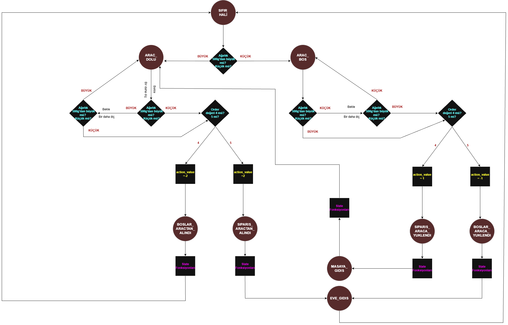
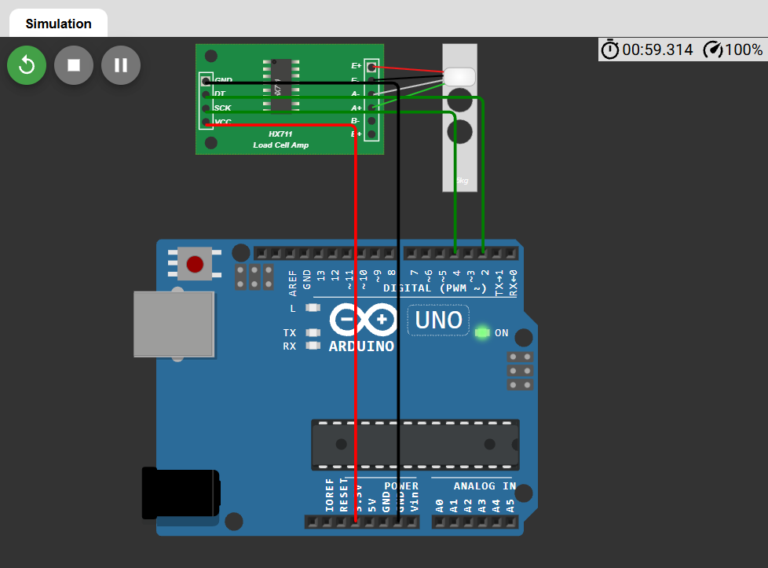

//I will update the English explanations as well later.

Bu kod EEM-391 Elektrik-Elektronik Mühendisliğinde Tasarım dersi kapsamında SHELAB grubunun projesi Robot Garson için yazılmıştır.

Robot Garson projesindeki bu kodda araca üzerindeki ağırlığın değişiminin tespitini kontrol eden bir hareket algoritması tasarladım. Kod aslen entegre bir kod olup tüm takım üyelerince yazılmış olan dönüş ve engel algılama gibi fonksiyonları içeriyor ama burada sadece kendi yazdığım kısmına yer vereceğim. 

Kodun temel FSM şeması:

Kodun WOKWİ üzerinde arduino-load cell bağlantıları: (Simülasyon denemeleri başarıyla sonuçlandırıldı.)

